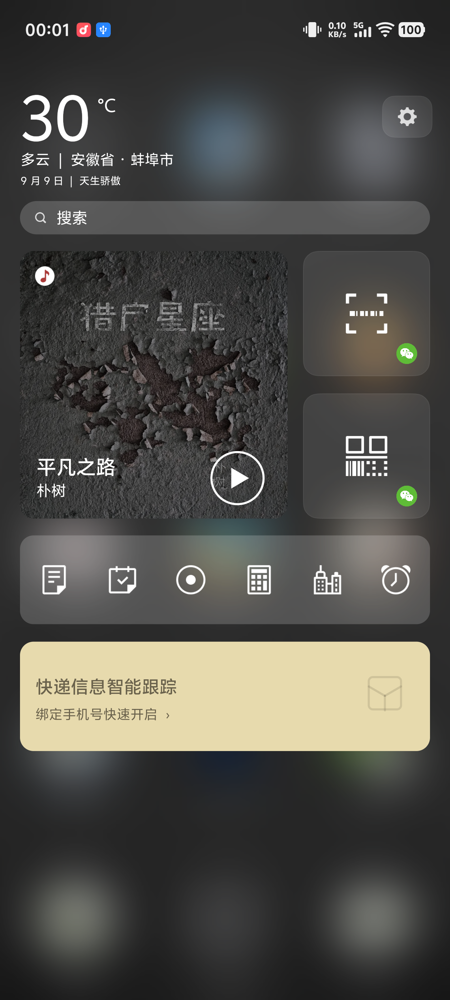

  

<h1 align="center">Smartisan Launcher Original Port</h1>

  <strong>天  生  骄  傲</strong>

  原版体验 ·
  普通 Android 兼容 ·
  跨 ROM 适配 ·
  持续维护

  
  
  
  

  
  
  
  

  <a href="https://b23.tv/ciGhPuQ"><strong>▶ 观看完整演示视频</strong></a>

---

## 项目简介

项目文档入口：[docs/INDEX.md](docs/INDEX.md)。

**Smartisan Launcher Original Port** 是一个基于原版 Smartisan Launcher 的兼容性移植项目。

项目保留了 12 / 20 宫格、Dock、主题、文件夹、翻页动画、桌面设置、动态图标、通知角标、解锁动画等核心体验，并针对现代 Android 系统补齐必要的系统接口、权限逻辑、图标适配、应用分身、多用户环境和在线资源更新能力。

这个项目想做的，不只是让原版 Smartisan Launcher 重新运行起来，而是希望在今天越来越复杂、花哨的 Android 系统上，让人们重新看见 Smartisan OS 那套简洁、精致、统一，并始终认真对待细节的设计美学。

> 有些设计不会再流行，但它依然值得被重新点亮一次。

## 当前状态

当前版本：**v1.5.7 / versionCode 32**
支持系统：**Android 8.0 及以上**
测试环境：已在 **Android 12 / Android 15 / Android 16** 环境开展兼容测试。

不同厂商 ROM 在应用分身、后台限制、主题行为、解锁广播和系统入口暴露方式上仍可能存在差异，本项目会持续针对真实设备反馈进行适配。

### v1.5.7 更新摘要

#### 新增功能

* **新增快捷桌面（负一屏）**：复用原版首页右滑手势和连续跟手进度，以当前桌面画面、渐进模糊和暗层承接完整内容页，支持拖动悬停、松手吸附、反向退出以及 Back / HOME 关闭。
* **恢复原版固定卡片**：加入天气、搜索、音乐与快捷支付、快捷工具、日历提醒和生活信息，按原版坐标适配不同宽高比；各类固定卡片可在设置中单独显示或隐藏。
* **新增音乐与快捷支付设置**：支持选择已安装的音乐应用和支付宝 / 微信快捷支付；接入标准 MediaSession 的曲名、歌手、封面、播放状态及上一曲、播放/暂停、下一曲控制。
* **快捷桌面配置支持备份恢复**：总开关、四类卡片、个性签名、音乐应用和支付方式会写入桌面备份；恢复预览可显示快捷桌面组件状态。
* **补充应用图标识别**：新增飞书国际版与哔哩哔哩国际版图标映射，并补充魅族 Flyme 官方天气动态图标识别。

> 本版本暂不包含第三方 Android 小组件的自定义添加、调整与管理功能。

#### 修复与优化

* **旧备份恢复误报修复**：修复恢复预览被其他设置页替换后遗留操作令牌，导致再次选择正常旧备份却提示“备份文件无效或已损坏”的问题；真正的操作占用现在会显示独立提示。
* **文件夹稳定性与显示修复**：修复文件夹渲染资源释放后的 GLThread 崩溃；隔离桌面图标缩放对打开文件夹的影响，并修复文件夹预览中日历、时钟、天气的尺寸、缓存和首次数据回放问题。
* **桌面与文件夹几何优化**：修正不同分辨率下的桌面局部偏移、文字大小与间距，以及打开文件夹的标签位置和图标尺寸；文件夹普通应用恢复复用桌面共享纹理路径。
* **默认图标显示统一**：DEFAULT APK 图标按透明可见边界对齐现有图标可见范围，减少应用原图留白差异造成的主体忽大忽小。
* **解锁动画时序修复**：恢复原版 Resume 预滚语义并保留单 Session 去重，改善解锁后桌面先静止再播放的问题，同时避免普通应用返回或重复广播误播。
* **设置与系统栏动画修复**：补齐桌面与设置主页的进入、退出动画，修正“音乐与快捷支付”返回上一级时方向相反的问题；桌面铺满布局不再与隐藏导航控件绑定。
* **原版视觉资源恢复**：恢复 v1.5.4 白色描边编辑齿轮、原版纵向初始化加载面板及默认主题状态栏背景。

### v1.5.6 更新摘要

#### 图标与桌面

* **新增备份与恢复功能**：支持备份及恢复桌面布局。
* **支持下滑打开控制中心和通知栏**：默认上滑打开搜索页面，左侧下滑打开通知栏，右侧下滑打开快捷中心（同时增加反向开关，支持上滑和下滑调转方向）。
* **统一图标外框**：优化图标显示统一，略微调整默认图标大小。
* **修复动态图标问题**：修复动态天气和日历大小统一，阴影统一。
* **文件夹打开动画优化**：解决上一版本部分机型打开或关闭文件夹时动画卡顿的问题。
* **修复短信角标**：修复短信角标不显示的问题。

#### 内置搜索页改进

* **搜索入口稳定性提升**：桌面DOCK上分向上滑动、反转方向下滑均可进入内置搜索；保留原有方向开关、单指、距离、角度和编辑状态限制。
* **搜索结果连续显示**：连续输入时保留已有结果面、标题和图标，最新查询完成后一次提交，减少结果区闪空和图标重绘。
* **联系人搜索可选启用**：默认不读取联系人；用户开启后才请求联系人权限并在后台建立索引。无联系人头像时复用当前联系人应用图标，能随主题和图标包变化。
* **过渡体验收敛**：搜索页直接承接桌面实时画面，不再使用截图/模糊回退，减少二次打开时的亮度跳变和闪烁。

#### 设置与兼容性

* **桌面设置项本地化**：修复之前设置页英文界面显示不全的问题。
* **图标源变化同步搜索**：主题、图标包或图标替换后，搜索页会重新水合当前图标，常用应用和结果列表保持一致。
* **系统优化**：优化安卓9返回时，丢失窗口导致卡死的问题。

### v1.5.5 更新摘要

#### 新增功能
* **全局图标来源收敛与重构**：优化图标切换逻辑，默认/改进版/图标包合并为图标样式。
* **小程序/PIN 快捷方式兼容恢复**：新增允许创建快捷方式添加到桌面（需要设置桌面为默认桌面，桌面允许通知权限）。
* **桌面手势优化**：新增桌面左侧下滑打开通知栏，右侧下滑打开控制中心，上滑打开搜索页面。
* **图标视觉细节提升**：修复桌面桌面图标、设置齿轮按钮物理纹理清晰度。
* **设置页返回逻辑优化**：统一设置页系统返回逻辑，屏幕手势返回、虚拟键返回、左上角返回按钮逻辑统一。
* **桌面HOME按钮逻辑优化**：桌面状态按home按钮或底部上滑返回首页。
* **解锁动画优化**：尝试兼容90Hz/120Hz/144Hz屏幕，优化解锁动画时长。

### v1.5.4 更新摘要

#### 新增功能
* 优化桌面与设置体验：统一设置页过渡动画、弹窗界面样式和回弹交互。
* 优化首次进入桌面：默认关闭高开销的改进版图标、动态天气日历、通知角标与横扫清除角标，减少首帧加载压力。
* 优化图标包加载方式，改为后台预热，不影响桌面启动。
* 新增单应用图标替换功能，支持系统图标、图标包、自定义图标等多来源匹配。
* 新增单应用支持重命名的功能。
* 大幅优化代码逻辑，提升系统流畅度。

#### 修复问题
* 修复首页向右滑动无反馈问题，恢复原版边界阻尼和回弹效果。
* 修复设置页面顶部/底部无法拉伸回弹问题，恢复系统 Overscroll 效果。
* 修复 12 / 20 宫格双向切换：12 宫格切至 20 宫格保留原板块成员、顺序与位置；20 宫格切回 12 宫格仅在超过容量时按原版规则拆分板块。
* 修复部分图标加载慢、启动阶段卡顿问题。
* 修复安装应用后无法显示，无法卸载应用的问题。
* 修复文件夹里应用图标长按松手后错位的问题。
* 修复应用图标界面点击左侧默认图标角标未及时刷新的问题。
* 修复页面底部小圆点不圆的问题。
* 修复切换透明主题、宫格切换闪回系统壁纸的问题。

## 核心特性

* **原版桌面体验**：保留 12 / 20 宫格、Dock、文件夹、多分辨率布局和经典交互逻辑。
* **原版多点手势**：支持四指横滑切换主题、双指捏合进入或退出多页总览/编辑状态、单指横滑翻页和桌面下滑搜索。
* **经典翻页动画**：支持默认、立体翻转、百叶窗、切牌等 Smartisan 风格动画。
* **主题与图标系统**：支持本地主题、在线主题、毛玻璃主题、透明主题兼容包、图标包和自定义图标。
* **在线图标库**：支持 GitHub / Gitee 在线图标资源，后台下载、本地缓存、自动刷新桌面。
* **图标适配**：针对相机、联系人、短信、文件管理、天气、应用商店、手机管家等系统应用进行图标映射。
* **通知角标与动态天气、日历**：支持动态天气、日历、通知角标、文件夹角标汇总和横扫清除。
* **应用分身与多用户**：识别厂商应用分身与多用户应用，并使用原版风格面具标记。
* **隐私板块与桌面设置**：支持页面隐藏、页面锁定和 Launcher 内置隐私密码。
* **解锁动画**：复用 Smartisan Launcher 内置动画引擎，兼容标准 Android 锁屏与主流 ROM 生命周期。
* **内置搜索页**：桌面上滑进入 Launcher 内置原版风格搜索，支持应用名称、拼音、首字母、搜索历史和常用应用；联系人搜索默认关闭，开启后才请求联系人权限。
* **快捷桌面**：首页右滑进入原版风格快捷桌面，提供天气、搜索、音乐与快捷支付、快捷工具、日历提醒和生活信息固定卡片。
* **在线更新机制**：通过 Gitee Release 提供更新资源，使用系统下载管理器完成安装。
